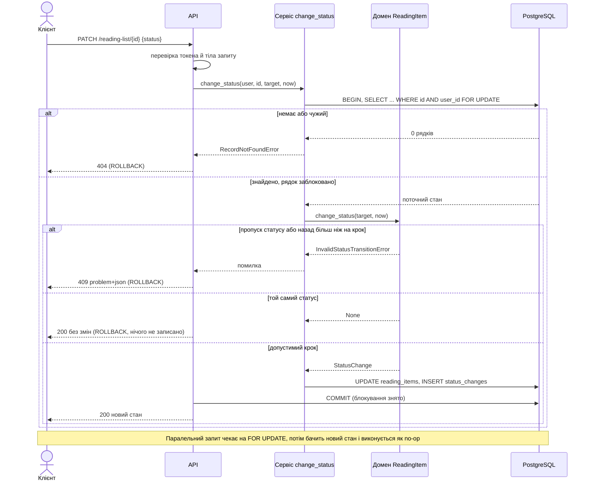

```mermaid
sequenceDiagram
    actor C as Клієнт
    participant A as API
    participant S as Сервіс change_status
    participant D as Домен ReadingItem
    participant DB as PostgreSQL

    C->>A: PATCH /reading-list/{id} {status}
    A->>A: перевірка токена й тіла запиту
    A->>S: change_status(user, id, target, now)
    S->>DB: BEGIN, SELECT ... WHERE id AND user_id FOR UPDATE
    alt немає або чужий
        DB-->>S: 0 рядків
        S-->>A: RecordNotFoundError
        A-->>C: 404 (ROLLBACK)
    else знайдено, рядок заблоковано
        DB-->>S: поточний стан
        S->>D: change_status(target, now)
        alt пропуск статусу або назад більш ніж на крок
            D-->>S: InvalidStatusTransitionError
            S-->>A: помилка
            A-->>C: 409 problem+json (ROLLBACK)
        else той самий статус
            D-->>S: None
            A-->>C: 200 без змін (ROLLBACK, нічого не записано)
        else допустимий крок
            D-->>S: StatusChange
            S->>DB: UPDATE reading_items, INSERT status_changes
            A->>DB: COMMIT (блокування знято)
            A-->>C: 200 новий стан
        end
    end
    Note over C,DB: Паралельний запит чекає на FOR UPDATE, потім бачить новий стан і виконується як no-op
```
